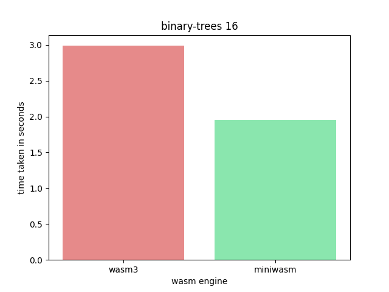
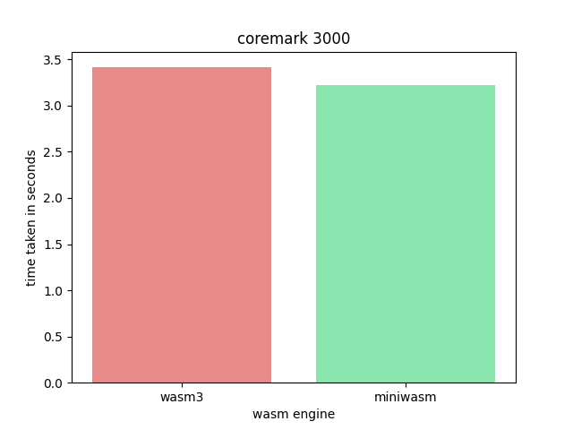
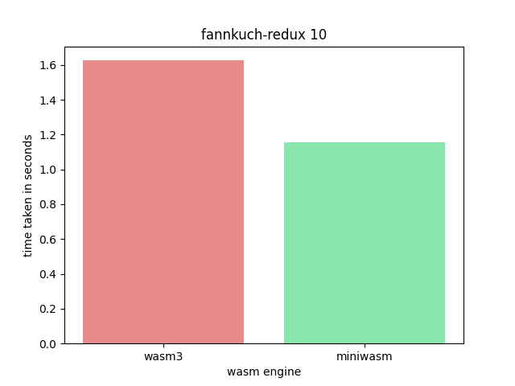
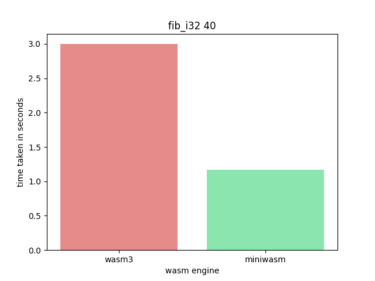
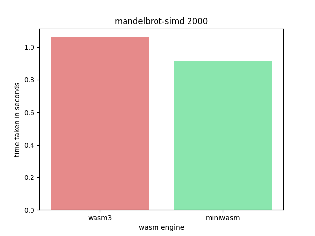
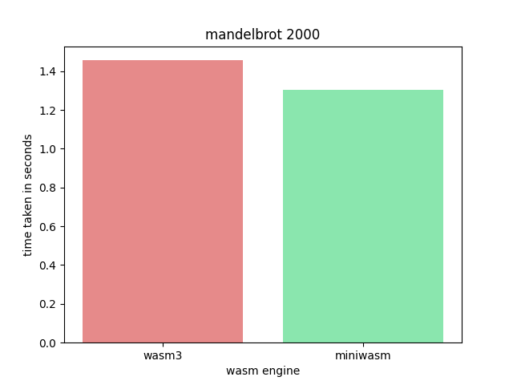
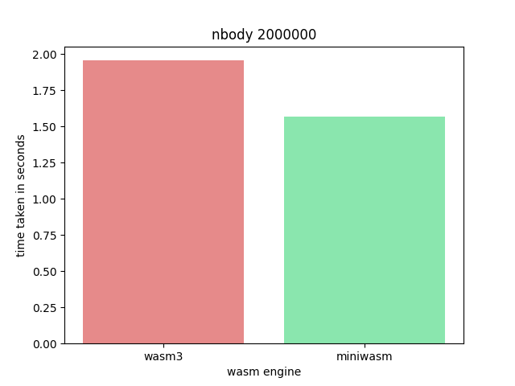
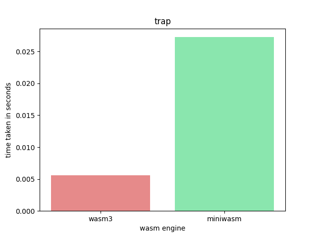

# Web49

current release: [v0.0.1](https://github.com/FastVM/Web49/releases/tag/v0.0.1)

Web49 contains a few tools for working with WebAssembly.

* interpreters
    * miniwasm
        * [fast](#benchmarks) wasm interpreter
            * uses technology from [minivm](https://github.com/fastvm/minivm)
        * suports multiple wasm formats
            * wasm binary format: ~100% complete
            * wasm text format: ~95% complete
            * wasm spect test: ~75% complete
        * includes a custom [WASI](https://github.com/webassembly/wasi) [implementation](src/api/wasi.c)
    * raywasm
        * wasm interpreter based on miniwasm
        * includes [raylib](https://github.com/raysan5/raylib) [bindings](src/api/raylib.c) [generated from](src/api/raylib.py) [json](src/api/raylib.json)
* wasm binary tools rewrite
    * much simpler than WABT's tools
    * much smaller than Binaryen's tools
    * [wat2wasm](main/wat2wasm.c)
        * convert wasm text into wasm binary
    * [wasm2wat](main/wasm2wat.c)
        * generates nearly identical wat as binaryen or wabt
        * turn wasm binary into wasm text
        * supports all of wasm 1.0 and some extensions
    * [wasm2wasm](main/wasm2wasm.c)
        * shrink numbers in wasm files generated by llvm
            * saves 0-4 bytes per 32 bit number
            * saves 0-10 bytes per 64 bit number
        * round trip parse and reemit

## Benchmarks

Benchmarks performed by [wasm3](https://github.com/wasm3/wasm3) and miniwasm. Ran on an 2020 Macbook Air (M1 + 8GiB ram) using [bench.py](bench.py).

All Benchmarks compiled with: `emcc -O2`

One can also view results run on [github actions](https://github.com/FastVM/Web49/actions)
One can run the benchmarks for themselves.

* python3
    * with pip
* make
    * tested with GNUMake
    * works with BSDMake too
* and a C compiler
    * gcc/clang/tcc works
    * msvc would work if someone rewrites two macros
        * #define NEXT() break
        * #define LABEL(X) case X:
        * probably a couple others

```sh
git clone https://github.com/fastvm/web49
cd web49
make CC=gcc # gcc is fastest in my tests
python3 -m pip install matplotlib
python3 bench.py
```

### [Binary Trees](test/bench/binary-trees.c)


### [Coremark](test/bench/coremark.c)


### [Fannkuch Redux](test/bench/fannkuch-redux.c)


### [Fibonacci on ints32_t](test/bench/fib_i32.c)


### [Mandelbrot with SIMD](test/bench/mandelbrot-simd.c)


### [Mandelbrot without SIMD](test/bench/mandelbrot.c)


### [Nbody](test/bench/nbody.c)


### [Executing A Trap](test/bench/trap.c)

